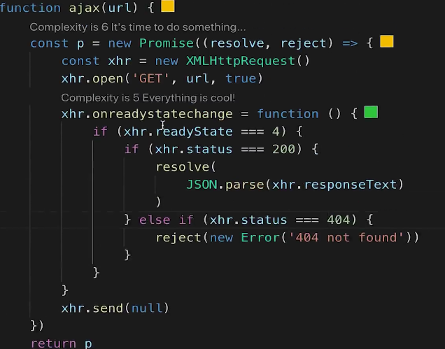
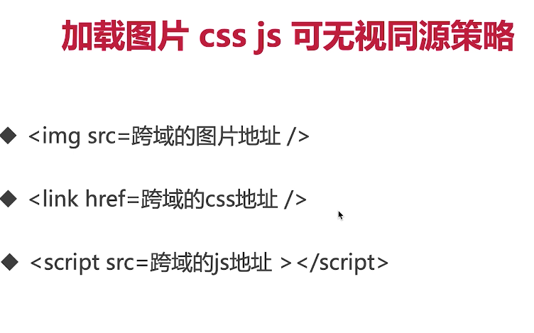
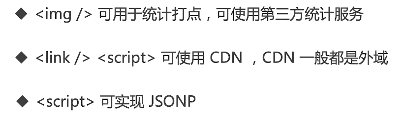
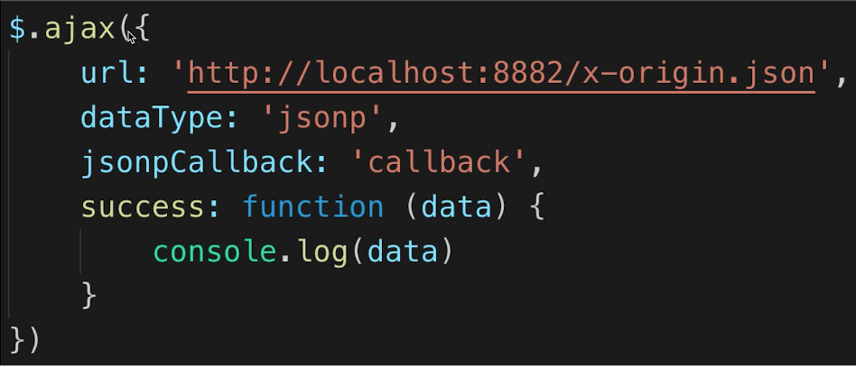
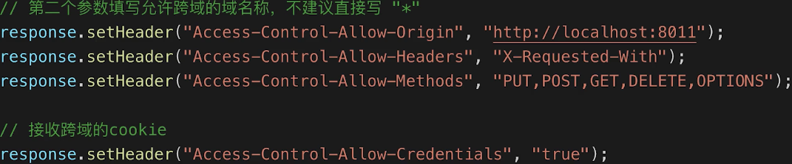

# Ajax
## 题目
- 手写（真用纸笔写）一个简易的 ajax （目前主流的工具有 jQuery Ajax， ES6 fetch，Axios）
- 跨域的常用实现方式

## 知识点
- XMLHttpRequest
- 状态码
- 跨域：同源策略，跨域解决方案

## 实现一个简易的 Ajax
```javascript
// GET
const xhr = new XMLHttpRequest()
xhr.open('GET', '/data/test.json', false) // true（默认） 为异步请求
xhr.openredaystatechange = function () {
  if (xhr.readyState === 4) { // 这里的数字的含义参考下面的 xhr.readyState
    if (xhr.status === 200) {
      console.log(
        JSON.parse(xhr.responseText)
      )
    } else {
      console.log('其他情况')
    }
  }
}

// POST
xhr.open('POST', '/login', false)
xhr.openredaystatechange = function () {
  if (xhr.readyState === 4) {
    if (xhr.status === 200) {
      console.log(
        JSON.parse(xhr.responseText)
      )
    } else {
      console.log('其他情况')
    }
  }
}

const postData = {
  username: 'yondee',
  password: '123456'
}

xhr.send(JSON.stringify(postData)) // 注意这里要将 JSON 转换为字符串，因为别的请求工具内置有处理方法所以可以直接将对象或者json作为参数
```
更复杂点，这里还可以改成 Promise 来实现：


## xhr.readyState
- 0 -（未初始化）还没有调用 send() 方法
- 1 -（载入）已调用send()方法，正在发送请求
- 2 -（载入完成）send() 方法执行完成，已经接受全部响应内容
- 3 -（交互）正在解析响应内容
- 4 -（完成）响应内容解析完成，可以在客户端调用（这里才可以获取`xhr.responseText`的内容，在此之前还没有解析完成）

## xhr.status
(同 [HTTP 响应代码](https://developer.mozilla.org/zh-CN/docs/Web/HTTP/Status))
- 2xx - 表示请求成功
- 3xx - 需要重定向，浏览器直接跳转（重定向是服务器）
- 4xx - 客户端请求错误
- 5xx - 服务器端错误

## 跨域
- 什么是跨域（同源策略）
- JSONP
- CORS（服务端支持）

## 同源策略
- ajax 请求时，**浏览器**要求网页和server必须同源
-同源指：协议，域名，端口 三者必须一致 


例如很多cdn的使用或者oss存储提供的链接，一般情况下是可以直接引用的（可以使用防盗链的服务器设置来杜绝这种情况）  
应用场景：


- 所有的跨域，都必须经过 server 端允许和配合
- 未经 server 端允许就实现跨域，说明浏览器有漏洞，不可信浏览器，是危险信号

## JSONP
服务器可以任意动态拼接数据返回，JSONP 是利用 `<script>`标签无视同源策略的特点进行服务器请求的。  
与我们访问网页不一定返回一个html文件相同，使用`<script>`标签访问一个JS文件，也不一定返回一个JS文件，这样服务器端便可以任意动态拼接数据并返回，只要服务端愿意返回。  
jQuery 实现 jsonp


## CORS - 服务器设置 http header
来自服务器端的设置，例如NodeJS等服务器脚本语言。

