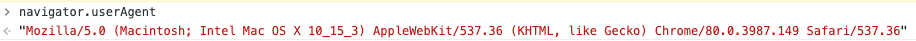
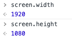

# BOM（Browser Object Model）操作
## 常见考题
- 如何识别浏览器的类型（navigator.userAgent）
- 分析拆解 url 各个部分（location API）

## 知识点
- navigator
- screen
- location
- history

一般常见判断浏览器的方式

实际工作需求中可以根据需求查阅参考别人ua解决方案

查看窗口宽高：  

location 常用 API
- `location.href` 查看完整网址
- `location.protocal` 查看协议
- `location.host` 查看网站域名地址
- `location.search` 查看网站get请求内容（查询参数）
- `localtion.hash` 获取地址`#`后面的内容
- `location.pathname` 获取地址路径（不包含域名地址）

history 常用 API
- `history.back` 后退
- `history.forward` 前进