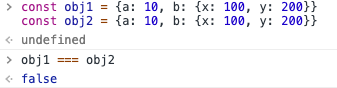
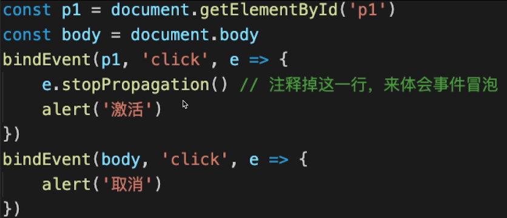
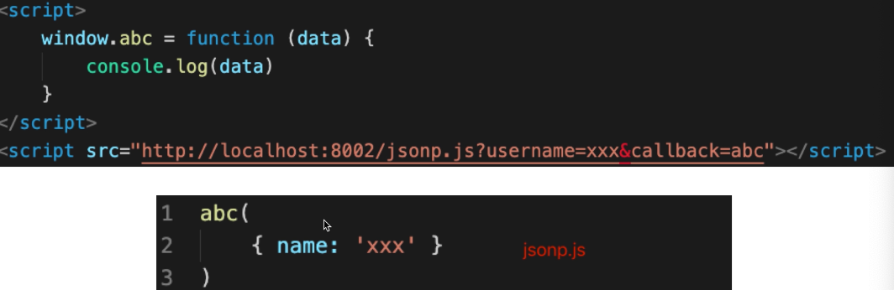
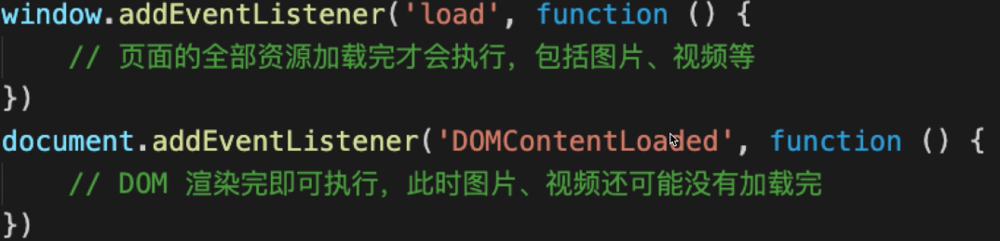
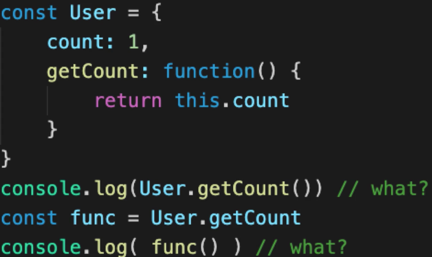
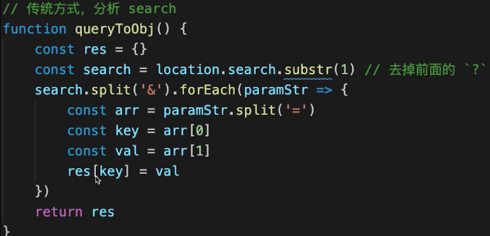
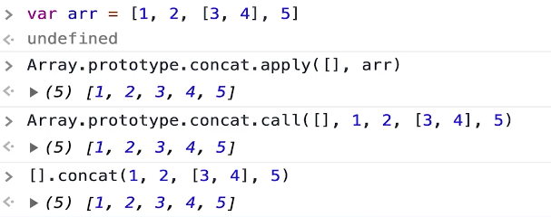

## var 和 let const 的区别？
- ar 是 **ES5** 语法，let const 是 **ES6** 语法；var **有变量提升**
- `var` 和 `let` 是变量，可修改；`const` 是常量，不可修改（除了修改对象的值）;
- `let` `const` 有**块级作用域**，`var` **没有**

## 什么是变量提升？
变量提升不会报错，执行代码会检查 `var` 定义的变量，哪怕在后面定义的，也会拿出来先定义成 `undefined`。
```javascript
console.log(a) // undefined
var a = 200
```
而块级作用域声明的变量不会这样被处理，提前使用变量会直接报错。

## 什么是块级作用域
声明的变量(let)和常量(const)有自己的作用域
```javascript
for (let i = 0; i < 10; i++) {
  let j = i + 1
}
console.log(j) // 这里会报错，因为i和j的作用域在for循环中，如果改成var便可以正常打印已经变化的变量
```
有效防止了作用域污染


## typeof 能判断哪些类型
- undefined string number boolean symbol - 值类型
- object (众所周知的bug：typeof null === 'object', 所以开发中注意判断)
- function  
在开发中一般用 typeof 判断变量所存储或引用的数据是符合程序所需的数据类型，所以一般不会用来判断 function


## 列举强制类型转换和隐式类型转换
- 强制：parseInt parseFloat toString 等
- 隐式：if、逻辑运算、==、+ 拼接字符串

## 手写深度比较 lodash.isEqual
[lodash](https://www.lodashjs.com/docs/latest)是什么？  
  
实现效果：
```javascript
const obj1 = {a: 10, b: {x: 100, y: 200}}
const obj2 = {a: 10, b: {x: 100, y: 200}}

isEqual(obj1, obj2) === true
```
两个对象是单独声明的，所以直接比较得到的结果是：  
  
因为引用的不是一个内存地址的内容
```javascript
// 判断是否是对象或数组
function isObject (obj) {
  return typeof obj === 'object' && obj !== null
}
// 对象（内容）全相等
function isEqual(obj1, obj2) {
  if (!isObject(obj1) || !isObject(obj2)) {
    // 值类型（参与 equal 的一般不会是函数）
    console.log(1)
    return obj1 === obj2
  }
  // 第一次比较
  if (obj1 === obj2) {
    console.log(2)
    return true
  }
  // 深度比较
  // 1. 先取出 obj1 和 obj2 的 keys 比较个数
  const obj1Keys = Object.keys(obj1)
  const obj2Keys = Object.keys(obj2)
  if (obj1Keys.length !== obj2Keys.length) {
    console.log(3)
    return false
  }
  // 2. 以 obj1 为基准，和 obj2 一次递归比较
  for (let key in obj1) {
    // 比较当前 key 的 val —— 递归！！！
    const res = isEqual(obj1[key], obj2[key])
    if (!res) {
      console.log(4)
      return false
    }
  }
  // 3. 全相等等
  console.log(5)
  return true
}
```

## split() 和 join() 的区别
```javascript
'1-2-3'.split('-') //[1, 2, 3]
[1, 2, 3].join('-') // '1-2-3'
```
- String.prototype.split() - 分割成字符串数组
- Array.prototype.join() - 数组拼接成字符串

## 数组的 pop push unshift shift 分别是什么
常规数组的推入推出操作，Array.prototype.pop() 推出并返回数组末尾（最后一个）的元素；Array.prototype.push() 将元素推入到数组末尾，返回新的数组长度；Array.prototype.unshift() 将元素推入数组开头，返回新的数组；Array.prototype.shift() 推出并返回数组开头（第一个）元素。


## 数组的 API，有哪些是纯函数
纯函数概念：
1. 不改变源数组（没有副作用，上面的数组操作就不是纯函数）
2. 返回一个数组
```javascript
const arr = [10, 20, 30, 40]

// concat
// 生成的新数组不再受源数组的影响，新数组也不会影响源数组
const arr1 = arr.concat([50, 60, 70])


// 返回一个全新的数组，不影响源函数
const arr2  = arr.map(num => num * 10)
const arr3  = arr.filter(num => num > 25)
const arr4 = arr.slice()

```
> 纯函数在 React 中是非常重要的概念

非纯函数：
- push pop shift unshif
- forEach
- some every
- reduce
> 以上函数都会改变数组或者是不返回数组

## [10, 20, 30].map(parseInt)
这个遍历的返回值是：[10, NaN, NaN]  
原因：
```javascript
// 拆解题目
[10, 20, 30].map(num, index) => {
  // 这里parseInt自动把map自带的参数加入了函数中，第二个参数代表了该进位系统的数字，这里的10的index为0，但是20为1，1没有相关进制所以为NaN
  return parseInt(num, index)
}
```

## slice 和 splice 的区别
slice 是纯函数  
splice 不是纯函数  
slice 名词解释为-切片,splice - 剪切  
slice 可以截取，但是不能拼接新的数据，返回一个新的数组对象，新的数组对象是原数组的浅拷贝  
splice 可以截取，并且在截取位置可以插入新的内容，删除或替换现有元素或者原地添加新的元素来修改数组，并以数组形式返回被修改的内容。

## ajax 请求 get 和 post 的区别
- get 一般用于查询操作，post 一般用于提交操作
- get 参数拼接在 url 上，post 放在请求体内（数据体积可以更大）
- 安全性方面：POST 易于防止 CSRF

## 函数 call 和 apply 的区别
使用形式的不同
```javascript
fn.call(this, p1, p2, p3) // call 需要一个个传递参数
fn.apply(this, arguments)  // apply可以将参数作为集合传入
```

## 事件代理（委托）是什么
参考之前DOM事件冒泡。总结下就是一个或者一组元素的事件委托到父层或者更外层元素上，事件真正绑定的是外层的元素，事件影响到需要绑定的元素上时，会通过事件冒泡机制从而触发外层绑定的事件，然后在外层元素上去执行。



## 闭包是什么？有何特性？有何影响？
解题思路
- 回顾作用域和自由变量
- 回顾闭包应用场景：作为参数被传入，作为返回值被返回
- 回顾：自由变量的查找，要在函数定义的地方（而非执行的地方）  

闭包的影响：变量会常驻内存，得不到释放。闭包不要乱用  
> 这里要小提到 JavaScript 的内存释放机制：声明的函数和变量在没有后续被使用的情况下会被释放。  
**闭包**函数作为返回值 —— 内存不会被释放

## 阻止事件冒泡和默认行为
- `event.stopPropagation()` 阻止事件冒泡
- `event.preventDefault()` 阻止默认行为

## 查找、添加、删除、移动 DOM节点
这里要注意的有：
- 插入和移动两个API是一样的，都是`Node.appendChild()`来执行
```JavaScript
const newP = document.crateElement('p')
newP.innerHTML = 'this is newP'

// 插入节点（假设此处的 div1 节点已经提前获取）
div1.appendChild(newP)

// 移动节点（假设此处的 div2 节点已经提前获取）
const p1 = document.getElementById('p1')
div2.appendChlid(p1)
```
> 区别就在于已经插入DOM的节点在使用 `Node.appendChild()`时是执行移动操作。
- `Node.removeChild()` 删除节点
- 直接操作 DOM 的时代逐渐过去，但是不能忘记基础，记得刻意练习

## 如何减少 DOM 操作
首先面对这个问题要想到：DOM 操作是非常昂贵（消耗性能的，DOM 的操作会引起浏览器对 DOM 的重新渲染）
- 缓存 DOM 查询结果（将获取的节点信息放在变量中，以便下次使用，不要多次获取）
- 多次 DOM 操作，合并到一次插入
```JavaScript
const list = document.getElementId('list')

// 创建一个文档片段，此时还没有插入到 DOM 结构中
const frag = document.createDocumentFragment()

for (let i = 0; i < 20; i++) {
  const li = document.createElement('li')
  li.innerHTMl = `List item ${i}`

  // 先插入文档片段中。这里的 frag 是 DocumentFragment 文档片段，不是真实 DOM 树的一部分，变化不会触发 DOM 树的重新渲染
  frag.appendChild(li)
}

// 都完成后，再统一插入到 DOM 结构中
list.appendChild(frag)
```

## 解释 jsonp 的原理，为什么他不是真正的 ajax？
jsonp 是借助`<script>`标签实现的，因为标签不受同源策略的影响。  
答题角度
- 浏览器的同源策略（服务端没有同源策略）和跨域
- 哪些 html 标签能绕过跨域？
- jsonp 的原理


## document load 和 ready 的区别
一个是 **DOM** 渲染完毕，一个是 **DOM** 以及**资源**全部渲染完毕。


## `==` 和 `===` 的区别
- `==` 会尝试类型转换
- `===` 严格相等（比较的类型需一致而值相等）
- 哪些场景采用 `==` ?（也会有需要用到`==`的地方，但是一般来说避免使用，生产场景大多事件都需要使用进行严格判断）

## 函数声明和函数表达式的区别
先弄明白什么是函数声明，什么是函数表达式
- 函数声明 `function fu() {...}` (用 `function` 关键字 + `function name` 声明)
- 函数表达式 `const fn = function () {...}` 直接将函数赋值给一个变量/常量
- 函数声明会在**代码执行前**预加载，而函数表达式不会
> 简单来说，函数声明可以提前调用函数，后声明，因为预加载的缘故，不会报错（有点像变量提升，不同的是它可以正常执行而不是`undefined`），而函数表达式就跟我们声明变量/常量一样的方式，需要提前声明好才能使用，否则会报错。
```javascript
const res = sum(10, 20)
console.log(res)

// 函数声明
function sum(x, y) {
  return x + y
}

// output: 30
```

## new Object() 和 Object.create() 的区别
- `{}` 字面量方式等同于`new Object()`，原型 `Objcet.prototype`，且推荐使用字面量，和数组一样会让代码更加简洁直观
- `Object.create(null)` 没有原型，这和字面量创建一个空对象不是一个概念，字面量创建的空对象也是具有原型的
- `Object.create({...})` 创建一个空对象，用于指定空对象的原型。如果参数是一个对象，则对象属性和方法都会放在这个对象的原型中，原型是一个对象那原型也有自己的原型，原型链形成。
- `new Object(obj)` 参数传入已经创建的对象别名，这个新建的对象和别名指向同一个内存地址

## this 的场景题
只要记住，this 指向当前执行位置（作用域），this 的指向和定义位置无关。

所以第一个 what? 答案是 1，第二个因为在全局作用域下，全局没有声明count 则返回 undefined

## JS 的正则表达式使用
```javascript
// 字符串 字母开头，后面字母数字下划线，长度6-30
const reg = /^[a-zA-Z]\w{5,29}$/
// 邮政编码
/\d{6}/
// 小写英文字母
/^[a-z]+$/
// 英文字母
/^[a-zA-Z]+$/
// 日期格式
/^\d{4}-\d{1, 2}-\d{1,2}$/
// 用户名 6-18 位，字母开头，字母数字下划线结尾
/^a-zA-Z\w{5, 17}$/
// 简单的ip地址匹配（只匹配数字和ip结构），注意这里的`.`如果不加`\`转义会匹配任意字符
/\d+\.\d+\.\d+\.\d+/
```
具体学习参考：https://deerchao.cn/tutorials/regex/regex.htm  
更多正则表达式的资料：https://developer.mozilla.org/zh-CN/docs/Web/JavaScript/Guide/Regular_Expressions

## 函数面试题运行结果题目技巧
先看函数执行位置，然后再看函数内容，作用域会影响函数运行结果

## 手写 trim 方法，保证浏览器兼容性
```javascript
// 将开头和结尾的空白字符换成空字符串
String.prototype.trim = function () {
  return this.replace(/^\s+/, '').replace(/\s+$/, '')
}
// 考点： 原型，this，正则表达式
```

## 获取多个数字中的最大值
两种方式：手写和`Math.max()`  
手写：
```javascript
function max() {
  const nums = Array.prototype.slice.call(arguments) // 变为数组
  nums.forEach(n => {
    if (n > max) {
      max = n
    }
  })
  return max
}
```

## 如何用 JS 实现继承
- class 继承 `class ClassName extends ParentClass`
- prototype 继承，原型链方式，可以使用诸如：`Object.create(ParentObject)`、`obj.prototype = ParentObj`
> 关于原型链继承方面的内容，可以多看看《JavaScript 高级程序设计》

## 如何捕获 JS 中的异常
手动捕获：
```javascript
try {
  // todo
} catch (ex) {
  console.error(ex) // 手动捕获 catch
} finally {
  // todo
}
```
自动捕获：
```javascript
window.onerror = function (message, source, lineNom, colNom, error) {
  // 第一，对跨域的 js，如 CDN 的，不会有详细的报错信息
  // 第二，对于压缩的 js，还要配合 sourceMap 反查到未压缩代码的行、列
}
```
`sourceMap`一个信息文件，里面储存着位置信息，一般在看很多源码的库中都有相应的.map文件

## 什么是 JSON
- json 是一种数据格式，本质是一段字符串。
- json 格式和 JS 对象结构一致，对 JS 语言更友好
- window.JSON 是一个全局对象，所以我们可以使用：`JSON.stringify()`、`JSON.parse()`

## 获取当前页面 url 参数
传统方式：
```javascript
function query(name) {
  const search = location.search.substr(1) // 类似 array.slice(1)
  // search: 'a=10&b=20&c=30'
  const reg = new RegExp(`(^|&)${name}=([^&]*)(&|$)`, 'i') // 相当于 /.../ 类似这样的字面量方式来构建正则表达式
  const res = search.match(reg)
  if (res === null) {
    return null
  }
  return res[2]
}
```
> 这里通过拆分字符串来实现也是可以的，这种方式的关键函数`String.prototype.split()`  
URLSearchParams
```javascript
function query(name) {
  const search = location.search
  const p = new URLSearchParams(search)
  return p.get(name)
}
```
> [URLSearchParams](https://developer.mozilla.org/zh-CN/docs/Web/API/URLSearchParams) 接口定义了一些实用的方法来处理 URL 的查询字符串，但是这里需要注意兼容性，在应用需要兼容处理的时候做好接口的判断

## 将 url 参数解析为 JS 对象
实现方法可以想到，参考上面获取 url 参数的函数进行修改即可
  
同样的也可以用 URLSearchParams 写法
  

## 手写 flatern 考虑多层级
一层拍平：
  
多层级拍平：
```javascript
function flat(arr) {
  const isDeep = arr.some(item => item instanceof Array)
  if(!isDeep) {
    return arr // 已拍平
  }
  const res = Array.prototype.concat.apply([], arr)
  return flat(res) // 递归，反正遇到深层次遍历就想想递归准没错
}
```

## 数组去重
- 传统方式，遍历元素逐个比较，实现去重
- 使用 Set
- 考虑计算效率
```javascript
// 传统去重（兼容性方式）
function unique(arr) {
  const res = []
  arr.forEach(item => {
    if (res.indexOf(item) < 0) {
      res.push(item)
    }
  })
  return res
}


// Set （无序结构，不能重复，推荐使用）
function setUnique(arr) {
  const setArr = new Set(arr)
  return [...setArr]
}
```

## 介绍 RAF requetAnimationFrame
- 想要动画流畅，更新频率要 60 帧/s，即 16.67ms 更新一次视图
- setTimeout 要手动控制频率，而 RAF 浏览器会自动控制
- 后台标签或隐藏 iframe 中，RAF 会暂停，而 setTimeout 依然执行  
> [参考 Demo](../../code/RAF/)

## 如何性能优化， 从哪几个方面考虑
- 原则：多使用内存、缓存、减少计算、减少网络请求
- 方向：加载页面，页面渲染，页面操作流畅度