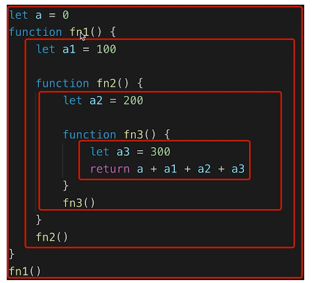

# 作用域和闭包
常见的题目：  
- this 的不同应用场景，如何取值
- 手写 bind 函数
- 实际开发中闭包的应用场景，举例说明  
知识点：  
- 作用域和自由变量
- 闭包
- this

## 作用域
  
作用域分类：
- 全局作用域
- 函数作用域
- 块级作用域

## 自由变量
- 一个变量在当前作用域没有定义，但被使用了
- 向上级作用域，一层一层一次寻找，直至找到为止（一般使用自由变量都是在外层声明好的）
- 如果到全局作用域都没找到，则报错 `xx is not defined`

## 闭包
作用域应用的特殊情况，有两种表现：
- 函数作为参数被传递
- 函数作为返回值被返回
```javascript
// 函数作为返回值
function create() {
  const a = 100
  return function () {
    console.log(a)
  }
}

const fn = create()
const a = 200
fn() // 100

// 函数作为参数
function print(fn) {
  let a = 200
  fn()
}

let a = 100
function fn() {
  console.log(a)
}
print(fn) // 100
```
**闭包：自由变量的查找，是在函数定义的地方，向上级作用域查找，不是在指定的地方**

## this
场景比较多
- 作为普通函数
- 使用 call apply bind
- 作为对象方法被调用
- 在 class 方法中调用
- 箭头函数（找上级的this）
**this 的取值取决于函数执行而不是函数定义，这和闭包的概念相反**
```javascript
function fn1() {
  console.log(this)
}
fn1()  // window

fn1.call({ x: 100 })  // { x: 100 }

const fn2 = fn1.bind({ x: 200 })
fn2() // { x: 200 }
```
对象中的this
```javascript
const zhangsan = {
  name: '张三',
  sayHi() {
    // this 即当前对象
    console.log(this)
  },
  wait() {
    setTimeout(function () {
      // this === window
      // 这里就相当于普通函数执行
      console.log(this)
    })
  }
}

// 上面的setTimeout的函数参数执行改变了this指向，那么也有办法将 this 指向当前对象，题解便是箭头函数
const zhangsan = {
  name: '张三',
  sayHi() {
    // this 即当前对象
    console.log(this)
  },
  waitAgain() {
    setTimeout(() => {
      // this 即当前对象
      console.log(this)
    })
  }
}
```

## 手写 bind 函数
[bind](../code/bind.js)

## 实际开发中闭包的应用
- 隐藏数据（不让外部改变，例如：cache）
```javascript
function createCache() {
  const data = {} // 闭包中的数据，被隐藏，不被外界访问
  // 提供 api 给外界访问
  return {
    set: function (key, val) {
      data[key] = val
    },
    get: function (key) {
      return data[key]
    }
  }
}

const c = createCache()
c.set('a', 100)
console.log(c.get('a')) // 100
```