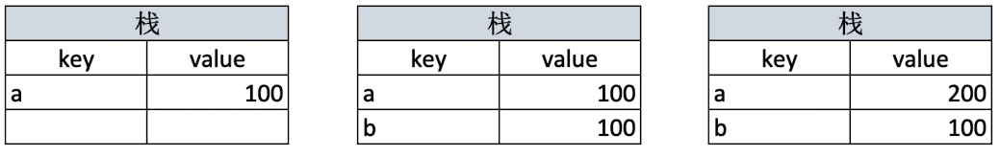
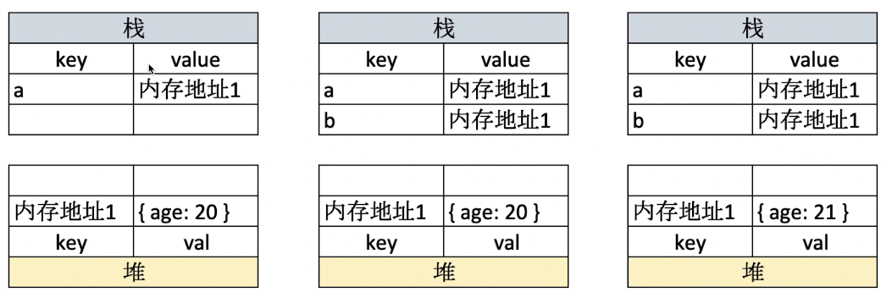
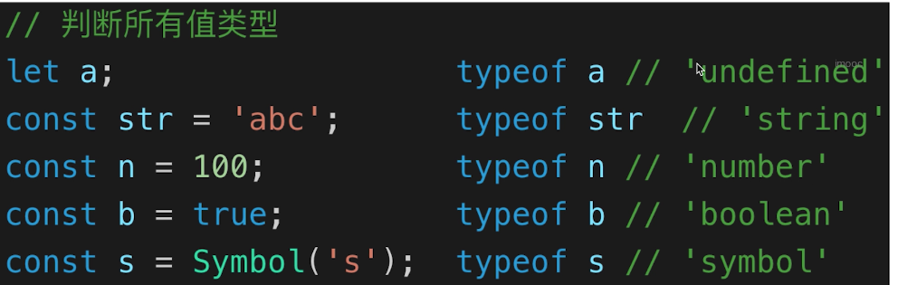
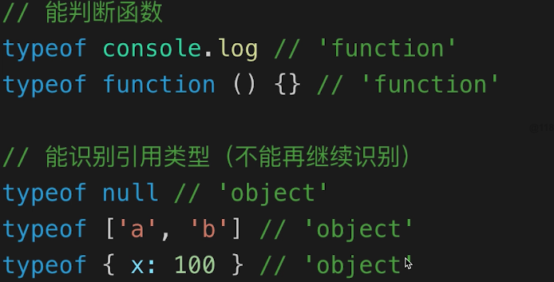
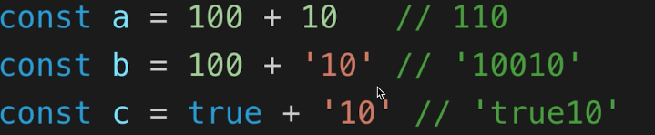
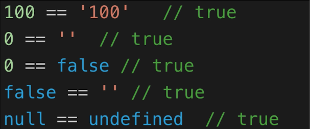
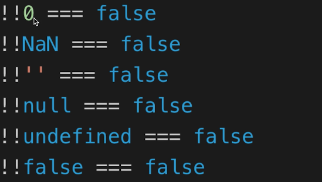

# 变量类型和计算
## 变量类型
### 值类型 和 引用类型
值类型在计算机中存储的结构：  
  
`key`表示变量的名字，`value`表示值
引用类型在计算机中存储的结构：  
  
如上所示，引用类型的赋值给变量名赋的值是一个内存地址，多个变量也可以指向相同的内存地址，栈和堆的数据叠加顺序也是不同的。

### 常见的值类型（基本数据类型）
```javascript
const a // undefined
const s = 'abc' // string
const n = '100' // number
const b = true // boolean
const s = Symbol('s') // symbol 唯一（es6）
```

### 常见的引用类型
```javascript
const obj = {x: 100} // objcet
const arr = ['a', 'b', 'c']  // array
const n = null // 特殊引用类型，指针指向为空地址

// 特殊引用类型，但不用于存储数据
function fn() {}
```
> 扩展引用类型的问题，在 JavaScript 中，**一切（引用类型）都是对象，对象是属性的集合**。
## typeof 运算符
判断值类型  
  
判断引用类型  
  
> 值类型的类型判断用`typeof`，引用类型的类型判断用`instanceof`。
## 深拷贝
手写：  
[deepClone](../code/deepClone.js)
> 关键词：类型判断，递归

## 变量计算 - 类型转换
触发自动类型转换的一些地方：
- 字符串拼接
- ==
- if 语句和逻辑运算  

### 字符串拼接，使用符号`+`：  
  
> 如果想要实现例如100+'10'这样的运算，且以数字进行相加，那么就要对'10'进行类型转换`parseInt('10')`

### `==` 运算符
不同类型会发生类型转换，会尽量让两边相等  
  
建议：除了 `== null` 之外，其他都一律用 `===`  
```javascript
const obj = { x: 100 }
if (obj.a == null) {}
// 相当于
// if (obj.a === null || obj.a === undefined) {}
```

## truthy & falsy
falsy 变量集合：  

> 除此之外都是truthy