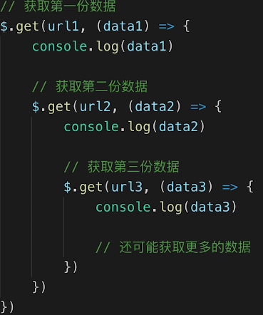

# 异步
### 常见问题：
1. 同步和异步的区别是什么？
2. 手写用 Promise 加载一张图片
3. 前端使用异步的场景有哪些？

## 知识点
- 单线程和异步
- 应用场景
- callback hell 和 Promise

## 单线程和异步
- JS 是**单线程**语言，只能同时做一件事
- 浏览器和 NodeJS 已支持 JS 启动进程（Web Worker），不意味着改变了JS单线程语言的本质
- JS 和 DOM 渲染共用同一个线程（DOM渲染和JS执行同时只有一个可以工作），因为 JS 可修改 DOM 结构
> 异步的背景就是根据JS单线程的特点来的  
异步为了解决遇到等待（网络请求，定时任务）不能卡住  
异步基于回调 callback 函数形式  

## 异步和同步的区别
- 基于 JS 是单线程语言
- 异步**不会**阻塞代码执行
- 同步**会**阻塞代码执行

## 应用场景
- 网络请求，例如 ajax 图片加载
- 定时任务，例如 setTimeout

```javascript
// ajax
console.log('start')
$.get('./data.json', function (data) {
  console.log(data)
})
console.log('end')

// img load
console.log('start')
let img = document.createElement('img')
img.onload = function () { // onload 是一种 callback 的形式
  console.log('loaded')
}
img.src = '/xxx.png'
console.log('end')
```

## callback hell (回调地狱)
总结一下就是套娃，回调里面还有回调一层层嵌套

Promise 有效解决了这个问题

## Promise
```javascript
function loadImg(src) {
  // Promise 构造函数中传入一个函数参数，函数参数具有两个参数resolve 和 reject
  const p = new Promise(
    (resolve, reject) => {
      const img = document.createElement('img')
      img.onload = () => {
        resolve(img)
      }
      img.onerror = () => {
        const err = new Error(`图片加载失败 ${src}`)
        reject(err)
      }
      img.src = src
    }
  )
  return p
}

const url = './images/8fea996a-3974-4eda-a990-c1ddbdc92b40.jpg'
loadImg(url).then(img => {
  //then 这里获取 promise 中 resolve 所返回的内容
  console.log(img.width)
  return img
}).then(img => {
  // 这个函数中的img参数是上面 then 的回调函数中所返回的 img
  console.log(img.height)
}).catch(ex => console.log(error(ex)))
// 最后捕获错误，来自 promise 中 reject 的返回

// 根据上面的应用场景模拟按顺序加载两张图片
const url1 = './images/8fea996a-3974-4eda-a990-c1ddbdc92b40.jpg'
const url2 = './images/3F101B3BEA53B4D28E1708E936B9227C.jpg'
loadImg(url1).then(img1 => {
  console.log(img1.width)
  return img1 // 返回对象
}).then(img1 => {
  console.log(img1.height)
  return loadImg(url2) // 返回 Promise 实例
}).then(img2 => {
  // 这里是获取上面 Promise 实例中 resolve 所返回的内容
  console.log(img2.width)
  return img2
}).then(img2 => {
  console.log(img2.height)
}).catch(ex => console.error(ex))
```