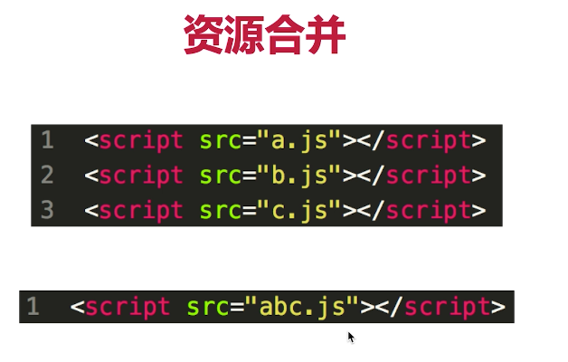
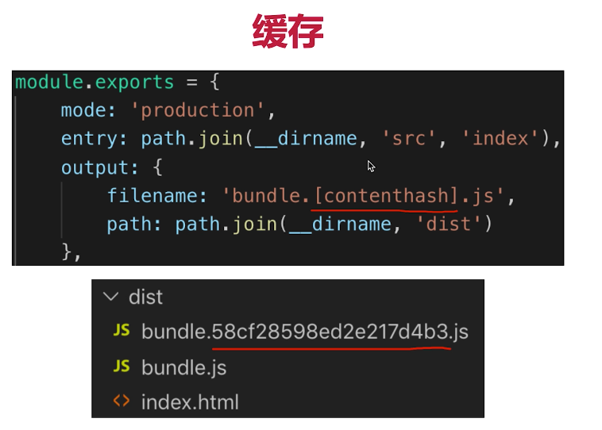
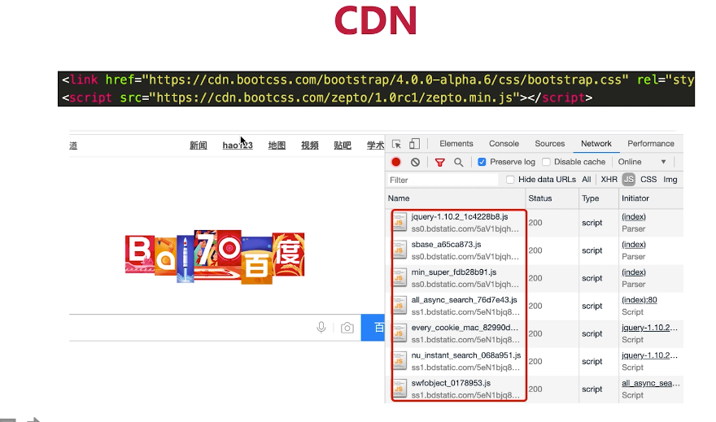
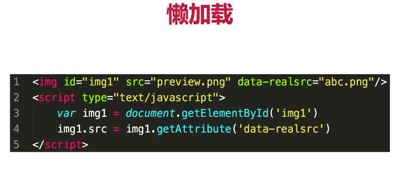
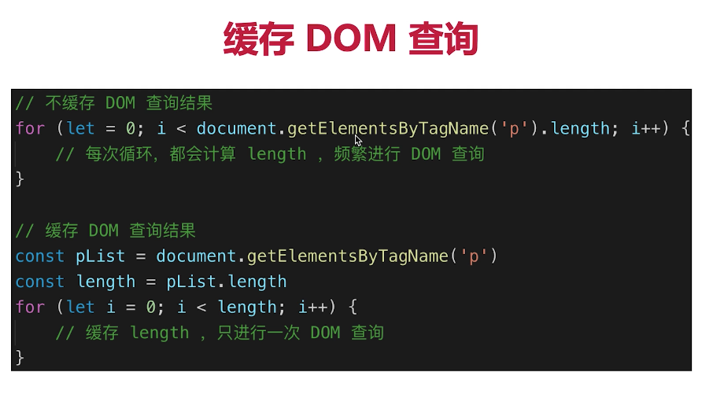
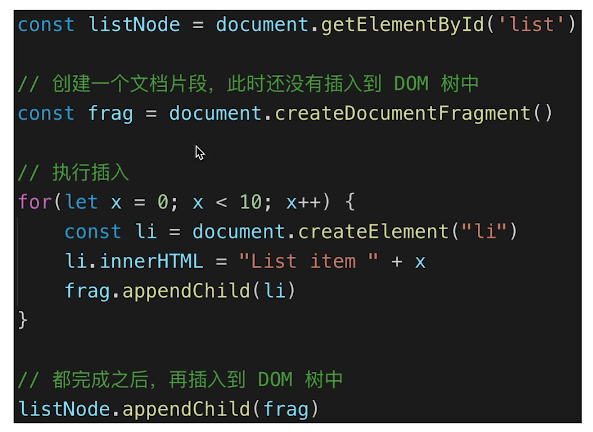
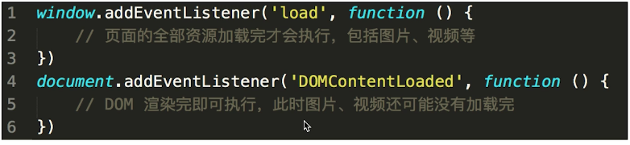

# 运行环境
## JavaScript 的运行环境
- 通常只运行在客户端（浏览器端，Nodejs可以运行在 server 端）
- 下载网页代码，渲染出页面，期间会执行若干 JS
- 要保证代码在浏览器中：稳定且高效

## 运行环境的应用优化
- 网页加载过程
- 性能优化
- 安全

## 网页加载过程
### 典型题目
- 从输入 url 到渲染出页面的整个过程
- window.onload 和 DOMContentLoaded 的区别

### 知识点
- 加载资源的形式
- 加载资源的过程
- 渲染页面的过程

#### 网页是如何加载并渲染出来的
##### 资源的形式（第一个知识点）
- html 代码
- 媒体文件（图片，视频等）
- javascript css

##### 加载过程（第二个知识点）
- DNS（domain name server） 解析：域名 -> IP 地址（口述就是：域名解析到ip地址）
- 浏览器根据 IP 地址向（通过系统的网络服务）服务器发起 http 请求
- 服务器处理 http 请求，并返回给浏览器
> 以上每个过程都可以展开说，包括三次握手四次挥手之类的计算机网络基础的内容，[具体参考](https://hit-alibaba.github.io/interview/basic/network/TCP.html)

##### 渲染过程 - 1（第三个知识点）
- 根据 HTML 代码生成 DOM Tree
- 根据 CSS 代码生成 CSSOM（css object model）
- 将 DOM Tree 和 CSSOM 整合（合并）成 [Render Tree](https://developers.google.com/web/fundamentals/performance/critical-rendering-path/render-tree-construction?hl=zh-cn)
> 在网页加载中发现css文件都会重新render，所以为了避免我们重复渲染，我们都将 css 文件放在 head 中

##### 渲染过程 - 2
- 根据 Render Tree 渲染页面
- 遇到 `<script>` 则暂停渲染，优先加载并执行 JS 代码，完成再继续
- 直至把 Render Tree 渲染完成
> 因为 JS 可能会改变我们已经渲染的 DOM 结构，所以会优先运行 JS
> 为了防止 DOM 渲染速度缓慢，一般将 JS 文件引入放在最后，让 DOM 先渲染完

##### window.onload 和 DOMContentLoaded
```javascript
window.addEventListener('load', function() {
  // 页面的全部资源加载完才会执行，包括图片、视频等
})

document.addEventListener('DOMContentLoaded', function () {
  // DOM 渲染完即可执行，此时图片、视频还可能没有加载完
})
```

## 性能优化
### 思路
- 是一个综合性问题，没有标准答案，但是要尽量全面（一套方案）
- 细节要知悉：手写防抖，节流（体验型的优化方案，定时器的使用）

### 性能优化原则
多用什么少用什么
- 多使用内存、缓存或其他方法
- 减少 CPU 计算量，减少网络加载耗时
- (适用于所有编程的性能优化 —— 空间换时间：例如 Chrome 标签页放在单独进程中，不过也要参考时代和设备基础)

### 从何入手
- 让加载更快
- 让渲染更快
#### 让加载更快
- 减少资源体积：压缩代码（例如 webpack production mode 生成的代码）
- 减少访问次数：合并代码（将多个JS放在一个JS中，这样只有一次网络请求。webpack 会合并代码，资源类型媒体类型文件亦可以合并，例如图片可以使用雪碧图Sprites），SSR 服务器端渲染（服务端处理好数据和请求一次给客户端）、缓存
- 使用更快的网络：CDN

#### 让渲染更快 - 1
- css 在 head，js 在 body 最下面
- 尽早开始执行JS，用 DOMContentLoaded 触发
- 懒加载（图片懒加载，上滑加载更多）


#### 让渲染更快 - 2
- 对 DOM 查询进行缓存
- 频繁 DOM 操作，合并到一起插入 DOM 结构
- 节流 throttle 防抖 debounce


#### 前端性能优化示例

例如 Webpack 就至少会将全局 JS 文件打包进一个 JS 文件中，以减少网络请求


`[contenthash]`
- 静态资源加 hash 后缀，根据文件内容计算 hash
- 文件内容不变，则 hash 不变，则 url 不变
- url 和文件不变，则会自动触发 [http 缓存机制](https://developer.mozilla.org/zh-CN/docs/Web/HTTP/Caching_FAQ)（客户端缓存），返回 304
> 尽可能在开发的时候命中这个缓存机制


#### CDN

> CDN 也会命中缓存机制

#### SSR
- 服务端渲染：将网页和数据一起加载，一起渲染
- 非 SSR（前后端分离）：先加载网页，再加载数据，再渲染数据
- 先前利用PHP JSP ASP等服务器脚本也是和SSR达成了相同的效果，在经历了前后端分离的时代之后，回归到了服务端渲染来，只是这次和以前我们接触PHP之类的服务器脚本并且应用其模板渲染页面有一定的差别

#### 懒加载

需要的时候在进行加载，而不是一次性加载完毕。

#### 查询 DOM 缓存

先获取 DOM 列表存于变量中再用JS进行循环查询

#### 多个 DOM 操作一起插入到 DOM 结构

使用[DocumentFragment](https://developer.mozilla.org/zh-CN/docs/Web/API/DocumentFragment)来创建文档片段（DocumentFragment不是真是 DOM 数的一部分，不会触发 DOM 树的重新渲染，且不会导致性能问题）

#### 尽早开始 JS 执行

使用 DOMContentLoaded 来执行JS，此时 DOM 已经渲染完成。

## 防抖 debounce
常用场景
- 监听一个输入框，文字变化后触发 change 事件 ;直接用 keyup 事件，则会频发 change 事件。**防抖**就是在用户结束输入或者暂停输入时，才会触发 change 事件。
(主要是对定时器的一个应用`setTimeout`)
```javascript
function debounce(fn, delay = 500) {
  let timer = null
  
  return function () {
    if (timer) {
      clearTimeout(timer)
    }
    timer = setTimeout(() => {
      fn.apply(this, arguments)
      timer = null
    }, delay)
  }
}
// to use
input1.addEventListerner('keyup', debounce(function () {
  console.log(input1.value)
}), 600)
```


## 节流 throttle
场景
- 拖拽一个元素时，要随时拿到该元素被拖拽的位置
- 直接用 drag 事件，会频繁触发，导致资源消耗和卡顿
- 节流：无论拖拽速度多快，都会按时触发一次（一般来说是 100ms ）
```javascript
function throttle(fn, delay = 100) {
  let timer = null
  return function () {
    if(timer){
      // 注意和 debounce 的区别在这里，这里不需要清空计时器, 节流是个需求持续触发的过程，只是避免了过度频繁触发消耗性能
      return
    }
    timer = setTimerout(() => {
      // 绑定传入参数的 this 以及参数
      // 如果这里直接使用传入的函数参数就会发生无法获取函数参数的参数的情况
      fn.apply(this, arguments)
      timer = null
    }, delay)
  }
}

// to use
div1.addEventListener('drag', throttle(function (e) {
  console.log(e.offsetX, e.offsetY)
}))
```
